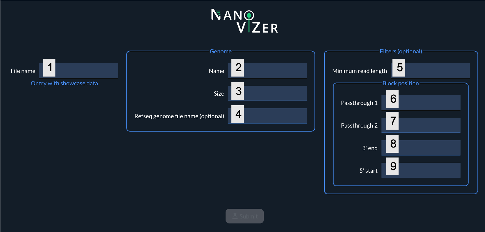
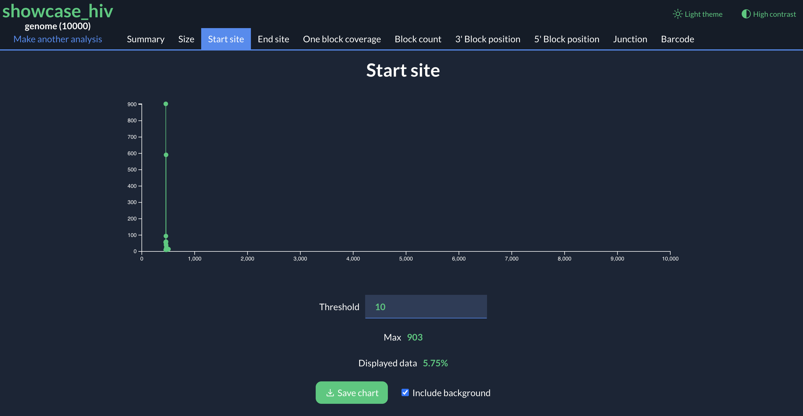
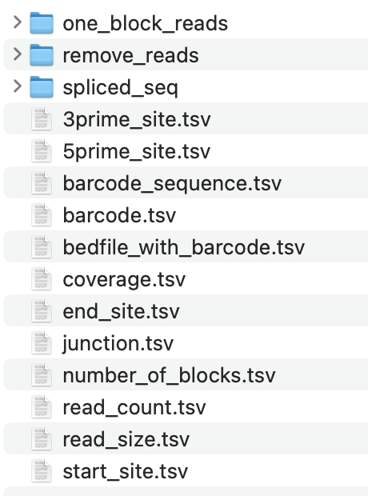

<!-- Bandeau image -->
<p align="center">
  
</p>

<!-- NanoViZer -->
<h1 align="center"><strong>NanoViZer</strong></h1>

---

## 1. Introduction

**NanoViZer (Nanopore Virus analyZER)** is a powerful bioinformatics tool designed to study deletions in viral RNA and genomes through full-length Nanopore sequencing.

### 1.1 Features

- **Annotation-Free Analysis:** Enables the study of viral deletions without prior genomic knowledge.
- **Broad Viral Family Compatibility:** Proven to work with multiple viral families, including HIV-1, SARS-CoV-2, HSV-1, and HDV.
- **User-Friendly Interface:** Simple command-line activation and web-browser-based analysis.
- **Data Privacy:** All data remains local and is never uploaded to an external server.
- **No Heavy Computational Requirements:** Only an internet connection is needed.

### 1.2 Ease of Use

NanoViZer is designed to be user-friendly, requiring minimal computational expertise. After installing a few necessary tools, users can activate NanoViZer with a simple command-line interface. All subsequent analyses are conducted via a web browser, such as Google Chrome. Your data remains local and is never uploaded to an external server, ensuring data privacy and security. Only an internet connection is required to run NanoViZer effectively.

### 1.3 Demonstration

NanoViZer has been successfully demonstrated to analyze data from various viral families, including:

- HIV-1
- SARS-CoV-2
- HSV-1
- HDV

### 1.4 How to Use

1. **Install Required Tools:** Follow the installation instructions to set up the necessary tools.
2. **Activate NanoViZer:** Use the provided command-line interface to activate NanoViZer.
3. **Conduct Analysis:** Open a web browser (e.g., Google Chrome) and follow the on-screen instructions to perform your analysis.

---

NanoViZer is an invaluable resource for researchers in the field of virology, providing a streamlined and effective way to analyze viral genome deletions using full-length Nanopore sequencing data.

---

## 2. Requierement
- Python >= 3.7
- Flask
- flask-cors
- pysam  
For installation, check the following section.

## 3. Installation

### 3.1 For Non-Bioinformaticians

If there are any issues, do not hesitate to contact us or ask to an IA!

#### 3.1.1 For Linux or macOS Users
1. First, download NanoViZer by clicking on the green "<> Code" button and choosing "Download ZIP".  
2. Then, unzip the file and move it to your Documents folder.  
3. Open the Terminal application already installed on your computer.  
4. If you are using macOS Silicon, use the following commands to install requirements :  
```bash
cd Documents/NanoViZer/ #Then press enter on your laptop
chmod +x install_packages.sh #Then press enter on your laptop
bash install_packages.sh #Then press enter on your laptop
```
5. If you are using macOS Intel, refer to section 3.1.2, point 5.

#### 3.1.2 For Windows Users

1. First, install WSL by following any tutorial you find online.  
2. Navigate to the Ubuntu environment.  
3. Type `pwd` to check your current location in your Terminal application.  
4. Use `cd following_folder` to navigate inside a folder that is inside your current folder (replace `following_folder` with the actual folder name).  

5. Navigate to the NanoViZer folder and then run the following commands:  
```bash
sudo apt update #Then press enter on your laptop and follow instructions
sudo apt install python3-pip #Then press enter on your laptop and follow instructions
cd Documents/NanoViZer/ #Then press enter on your laptop
chmod +x install_packages.sh #Then press enter on your laptop
bash install_packages.sh #Then press enter on your laptop
```
If the pip installation does not work, you can search forums by indicating the error message from your terminal, ask an AI for help, or, as a last resort, contact us.  

### 3.2 For Bioinformaticians

The NanoViZer folder does not need to be in the Documents folder; this is just to facilitate explanations. Choose your own method to install these requirements (e.g., pip, conda, etc.).
The install_packages.sh file allows you to download all the required packages through pip3.

## 4. Usage
### 4.1 Open

After installing the requirements (see section 3), run the following command:
```bash
python3 NanoViZer.py
```
This kind of text should appear:
```bash
 * Serving Flask app 'test_api'
 * Debug mode: on
WARNING: This is a development server. Do not use it in a production deployment. Use a production WSGI server instead.
 * Running on all addresses (0.0.0.0)
 * Running on http://127.0.0.1:5000
 * Running on http://192.168.1.140:5000
Press CTRL+C to quit
 * Restarting with stat
 * Debugger is active!
 * Debugger PIN: 113-194-444
```
Keep your Terminal application open to use NanoViZer.  
After that, open Google Chrome and go to this website:
```bash
https://nanovizer-aoz.piksail.com/
```
Indicate at least the File name (bam file), the name of your genome use for mapping and the size of your genome.  
Other parameters are optional.

### 4.2 Launch
To use NanoViZer, please complete the information on the homepage. Only 'File name,' 'Name,' and 'Size' are required to launch NanoViZer; all other information is optional.  


**Mandatory options:**  
1- Specify the alignment file : your_file.bam  
2- Specify the genome name use for the mapping.  
If you do not know the name of the genome, enter anything. After launching NanoViZer, navigate to the 'data' folder and then to the file 'your_file.bed' that will have been generated. The names of all genomes are listed in column 1. Please find the name of the genome you wish to study and enter it in box 2 on the homepage.  
3- Specify the size of your genome.  

**Optional options:**  
4- Specify the name of the refseq file use for the mapping: refseq.fasta  
This file should be placed in the 'genome' folder and is used to obtain the sequences present at the junction sites.  
5- Specify the minimum size of a read to be considered in the analysis.  
6, 7, 8, 9- Specify the positions of the different filters to filter the reads based on their alignment with the reference genome. See Figure XXX in the article for more details.  

**Launch NanoViZer**  
After completing the mandatory and optional options, click the 'Submit' button to launch NanoViZer.  

### 4.3 Analysis

**Results**  
The results obtained by NanoViZer are saved in text format in the 'Results' folder, and a new page opens with the graphical representations.  
  
**Navigate**  
You can navigate through the page by scrolling or by directly clicking on the tabs.  
  
**Threshold**  
To change the analysis thresholds, modify the value of the threshold, which is set to 10 by default.  
  
**Download chart**  
To download the images, click on 'Save chart.' To download the images with a white background, first click on the 'Light theme' tab, and then click on 'Save chart.'
  
**Raw data**  
The raw data generate by NanoViZer are save in the result folder.  
The following folders and file are automaticaly created:  
  

**Foler and file descriptions**  
one_block_coverage/: This folder contain the bedfile of untruncated reads.  
remove_reads/: This folder contain the bedfile of reads remove by the optionnal filters.  
spliced_seq/: This folder contain the bedfile of truncated reads.  
3prime_site.tsv: This file contain position of the junction at the 3' position of the block.  
5prime_site.tsv: This file contain position of the junction at the 5' position of the block.
barcode_sequence.tsv: This file contain the sequence at the the junctions.   
barcode.tsv: This file contain all the barcode and the associated count.  
bedfile_with_barcode.tsv:  This is the bedfile of the analysis reads where each barcode was added at the end of lines.
coverage.tsv: This file contain the read coverage of the genome.  
end_site.tsv: This file contain the position of the end of reads.  
junction.tsv: This file contain all the junction analysis and the count for each of theme.  
number_of_blocks.tsv:  This file contain the count of reads that contain 2 or more blocks.  
read_count.tsv:  This file contain the summary of NanoViZer.    
read_size.tsv: This file contain the count of reads at a given size.   
start_site.tsv: This file contain the count of the firts position of the reads.  

## 5. Citation

